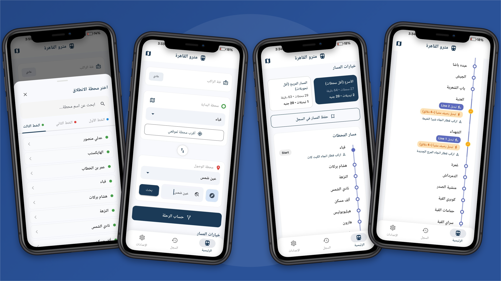
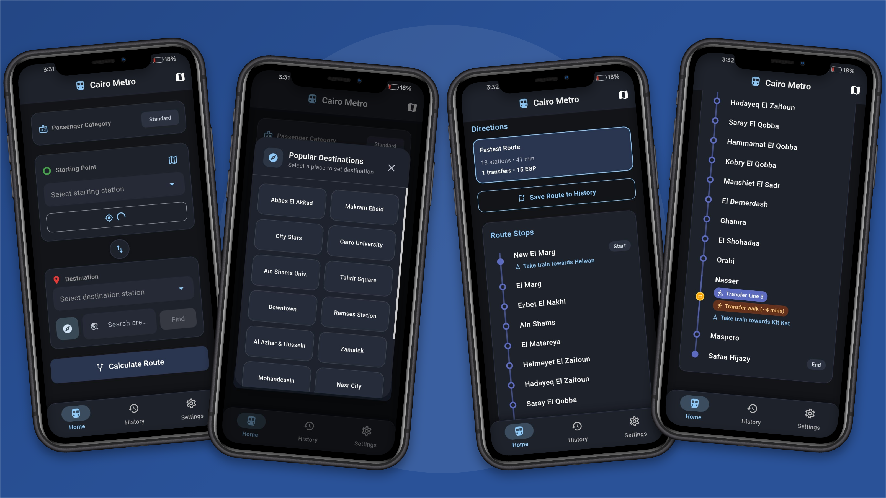
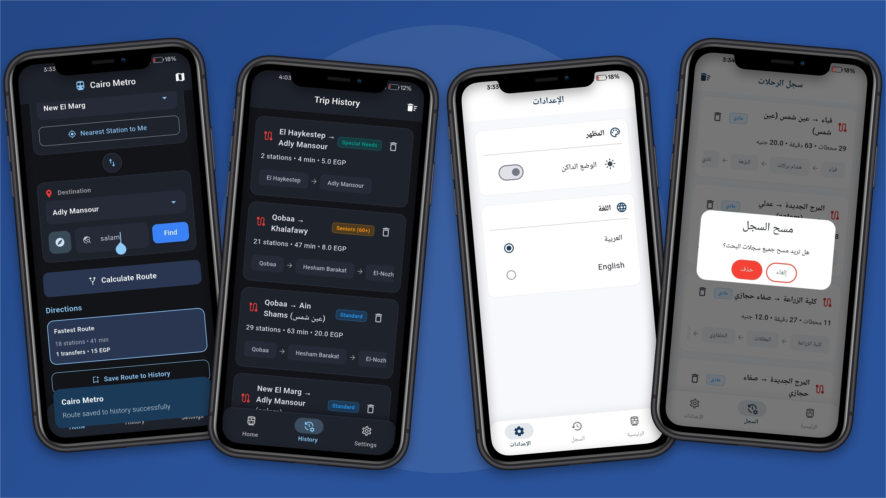

# 🚇 Cairo Metro & Monorail Navigator

A modern, offline-first transit guide and multimodal route navigation application for the Greater Cairo transit network (Metro Lines 1, 2, 3 & Monorail East), built with **Flutter** and **GetX**. Designed to provide instant route calculations, walking transfer guidance, accurate multimodal fare breakdown based on official transit tiers, and an intelligent offline area guide.

---

## ✨ Features

- **🚀 Smart Multi-Criteria Route Optimization (BFS Graph Traversal):**
  - **Fastest Route:** Minimizes total stations and transit duration.
  - **Comfort Route:** Prioritizes fewer line transfers for a smoother commute.
- **💰 Realistic & Multimodal Fare Calculation:**
  - Automated fare calculation matching Cairo Metro's official transit tier system.
  - **Monorail Tiered Pricing:** Dynamic fare calculation for Monorail East (22 stations).
  - **Combined Trip Fare Breakdown:** Clear split pricing for multimodal commutes (e.g., `20 EGP Monorail + 15 EGP Metro`) across route cards and trip history.
  - Category-based dynamic pricing (**Standard**, **Seniors 60+**, and **Special Needs**).
  - Minimum fare unification across alternative routes for the same source-destination pair.
- **🚝 Monorail East Integration & Smart Transfers:**
  - Full support for the 22 stations of the Monorail East line (Stadium to Justice City).
  - **Pedestrian Interchange Detection:** Context-aware walking guidance at Stadium Interchange (~3 min walk) with safety checks against invalid route charges.
  - Dedicated tab in station selector with official line color branding.
- **📍 Location-Aware & Offline-First:**
  - **GPS Integration:** Instant detection of the nearest station using device sensors without mobile data.
  - **Local Directory Search:** Built-in offline database for 35+ major Cairo landmarks and districts (e.g., Abbas El Akkad, Faisal, El Salam).
  - Direct integration with Google Maps to view exact station locations.
- **🗺️ Interactive Timeline & Station Exploration:**
  - Detailed vertical timeline displaying intermediate stops, official line colors, train directions, and walking transfer instructions.
  - Complete network overview covering Line 1, Line 2, Line 3, and Monorail East.
- **📜 Trip History & Search Caching:**
  - Save recent trips locally with custom destination tags reflecting search queries.
  - Complete trip summaries including detailed fare breakdowns, duration, and intermediate stops.
- **🌍 Internationalization & Persistent Theming:**
  - Full Arabic and English bilingual support (RTL/LTR) with locale persistence across sessions.
  - Dark and Light modes saved directly to local storage (`shared_preferences`).
  - Custom animated Splash Screen on startup using GetX and Flutter animation controllers.

---

## 🛠️ Tech Stack & Architecture

- **Framework:** [Flutter](https://flutter.dev/) (Dart SDK `^3.12.2`)
- **State Management & Navigation:** [GetX](https://pub.dev/packages/get)
- **Routing Engine:** Multimodal Graph data structure using Breadth-First Search (BFS), transfer penalties, and pedestrian interchange links.
- **Local Persistence:** `shared_preferences`
- **Geolocation & External Maps:** `geolocator`, `geocoding`, `url_launcher`
- **Branding:** `flutter_launcher_icons`
- **Animations:** Custom `AnimationController` (Fade Transition)

---

## 📸 App Showcase

<div align="center">

### Splash & Rider Category Setup


<br/><br/>

### Route Planning & Interactive Timeline (Arabic - Light Mode)


<br/><br/>

### Offline Landmarks & Multi-Route Navigation (English - Dark Mode)


<br/><br/>

### Trip History & App Settings


</div>

---

## 🚀 Getting Started

### Prerequisites
- Flutter SDK (`>= 3.12.2`)
- Android Studio / VS Code
- Git

### Installation & Run

```

# 1. Clone the repository
git clone [https://github.com/shimaakhaled1410/cairo-metro.git](https://github.com/shimaakhaled1410/cairo-metro.git)
cd cairo-metro

# 2. Install dependencies
flutter pub get

# 3. Run the application
flutter run

```